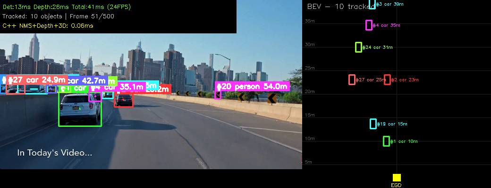
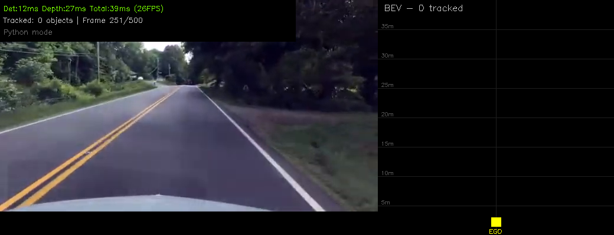

# 🎯 Camera-Based 3D Perception Stack

<div align="center">

**Real-time 3D object detection, depth estimation, multi-object tracking, and bird's-eye-view projection from a single RGB camera — with C++ acceleration and ROS2 integration for robotic deployment.**

[](https://python.org)
[](https://pytorch.org)
[](https://docs.ros.org/en/humble/)
[](https://github.com/ultralytics/ultralytics)
[](https://huggingface.co/depth-anything/Depth-Anything-V2-Small-hf)
[](https://isocpp.org)
[](https://github.com/pybind/pybind11)
[](https://opencv.org)
[](LICENSE)

[**Results**](#results) · [**Architecture**](#architecture) · [**C++ Speedup**](#c-acceleration) · [**ROS2 Node**](#run-with-ros2--rviz) · [**Quick Start**](#quick-start)

</div>

---

<div align="center">


*Camera-based 3D perception: YOLOv8 detection + Depth Anything v2 + ByteTrack tracking + BEV projection at **22+ FPS** on RTX 3060*

</div>

---

<div align="center">

| 🚀 22+ FPS Real-Time | 🎯 8-17 Objects/Frame | ⚡ 670x C++ Speedup | 🤖 ROS2 Ready |
|:---:|:---:|:---:|:---:|
| RTX 3060 6GB | Car, Person, Truck, Bus | IoU computation | MarkerArray + RViz |

</div>

---

## Key Features

- **3D Object Detection** — YOLOv8 + Depth Anything v2 for camera-only 3D perception (no LiDAR needed)
- **Multi-Object Tracking** — ByteTrack with Kalman filter for persistent object IDs across frames
- **Bird's Eye View** — Real-time top-down projection of all detected objects with distance
- **C++ Acceleration** — pybind11 module: 670x speedup on IoU, 5.7x on depth sampling
- **ROS2 Integration** — Publishes MarkerArray, Image, and JSON detections for robotic systems
- **RViz Visualization** — One-command launch: perception + TF + RViz with 3D boxes
- **Real-Time** — 22+ FPS on RTX 3060 laptop GPU (46ms per frame)

## Architecture

```
RGB Camera / Video
    |
    +-- YOLOv8m ----------- 2D Detection (boxes, classes, confidence)
    |                           |
    +-- Depth Anything v2 -- Monocular Depth Map
    |                           |
    +-- 3D Fusion <------------- 2D Boxes + Depth -> 3D Positions
            |
            +-- ByteTrack ----- Multi-Object Tracking (persistent IDs)
            |
            +-- C++ NMS ------- Fast post-processing (670x speedup)
            |
            +-- BEV Renderer -- Bird's Eye View visualization
            |
            +-- ROS2 Node ----- /perception/markers (RViz)
                                /perception/detections (JSON)
                                /perception/image (annotated feed)
```

## Results

| Metric | Value |
|--------|-------|
| FPS | **22+ FPS** (RTX 3060 6GB) |
| Objects per frame | 8-17 |
| Detection classes | car, person, truck, bus, bicycle, motorcycle |
| Depth estimation | Monocular, 2-70m range |
| Tracking | ByteTrack with Kalman filter |
| C++ NMS speedup | **670x** over Python |
| C++ depth sampling speedup | **5.7x** over Python |
| Total C++ overhead | **0.38ms** per frame |
| GPU memory | ~2GB |

### Sample Output Frames

<div align="center">

| Camera + BEV (Tracked) | Description |
|:-:|:-:|
|  | Urban driving: cars detected at 8-50m with persistent track IDs |
|  | Multi-class: cars, persons, trucks with BEV positions |

</div>

### RViz 3D Visualization

<div align="center">


*ROS2 RViz2 showing 3D detection boxes in real-time from the perception node*

</div>

## Tech Stack

| Category | Technologies |
|----------|-------------|
| Detection | YOLOv8m (Ultralytics) |
| Depth | Depth Anything v2 Small (HuggingFace) |
| Tracking | ByteTrack + Kalman Filter |
| Deep Learning | PyTorch 2.x, CUDA 12.x |
| C++ Acceleration | pybind11, g++ -O3, C++17 |
| Visualization | OpenCV, RViz2, BEV Renderer |
| Robotics | ROS2 Humble (MarkerArray, Image, TF2) |
| Language | Python 3.10, C++17 |

## Project Structure

```
camera-3d-perception/
|-- configs/
|   |-- perception.yaml          # Pipeline configuration
|   +-- perception.rviz          # RViz2 display config
|-- src/
|   |-- depth/
|   |   +-- depth_to_3d.py       # Pinhole camera model, 2D+depth -> 3D
|   |-- tracking/
|   |   |-- byte_tracker.py      # Kalman filter + IoU matching
|   |   +-- tracker.py           # ByteTrack main tracker
|   |-- visualization/
|   |   +-- bev_renderer.py      # Bird's Eye View rendering
|   |-- cpp/
|   |   |-- perception_cpp.cpp   # C++ NMS, depth sampling, IoU, 3D conversion
|   |   +-- build.sh             # Compilation script
|   +-- ros2_node/
|       +-- perception_node.py   # ROS2 publisher node
|-- scripts/
|   |-- run_perception.py        # Standalone pipeline (no tracking)
|   +-- run_perception_tracked.py # Full pipeline with tracking + C++
|-- launch/
|   +-- perception_launch.py     # ROS2 launch file (starts everything)
|-- models/                      # Downloaded model weights (gitignored)
|-- data/                        # Input videos (gitignored)
|-- outputs/                     # Generated videos and frames
|-- docs/                        # Documentation and diagrams
+-- README.md
```

## Quick Start

### Prerequisites

- Ubuntu 22.04
- NVIDIA GPU with CUDA support
- Conda (Miniconda or Anaconda)
- ROS2 Humble (optional, for ROS2 features)

### Installation

```bash
# Clone
git clone https://github.com/Rothvichea/camera-3d-perception.git
cd camera-3d-perception

# Create conda environment
conda create -n perception python=3.10 -y
conda activate perception

# Install dependencies
pip install torch torchvision --index-url https://download.pytorch.org/whl/cu121
pip install ultralytics opencv-python numpy matplotlib pyyaml
pip install transformers huggingface_hub
pip install lap  # for ByteTrack

# Build C++ module
bash src/cpp/build.sh

# Download a test video (or use your own)
# Place .mp4 files in data/videos/
```

### Run Standalone (no ROS2)

```bash
# Basic pipeline (detection + depth + BEV)
python3 scripts/run_perception.py

# Full pipeline with tracking + C++ acceleration
python3 scripts/run_perception_tracked.py

# Output video saved to outputs/videos/
```

### Run with ROS2 + RViz

```bash
source /opt/ros/humble/setup.bash
conda activate perception

# Launch everything (perception + TF + RViz) with one command
ros2 launch launch/perception_launch.py
```

### ROS2 Topics

| Topic | Type | Description |
|-------|------|-------------|
| `/perception/markers` | `MarkerArray` | 3D boxes for RViz visualization |
| `/perception/image` | `Image` | Annotated camera feed |
| `/perception/detections` | `String` | JSON with tracked objects and 3D positions |
| `/perception/bev` | `Image` | Bird's eye view |

### Example Detection JSON

```json
{
  "frame": 150,
  "latency_ms": 43.2,
  "num_tracked": 8,
  "objects": [
    {"id": 3, "class": "car", "distance": 12.5, "x": 2.1, "z": 12.3, "confidence": 0.87},
    {"id": 7, "class": "person", "distance": 8.2, "x": -1.5, "z": 8.1, "confidence": 0.72}
  ]
}
```

## Methods

### Depth-to-3D Projection

Uses the inverse pinhole camera model to lift 2D detections into 3D space:

```
X = (u - cx) * Z / fx      (lateral position in meters)
Y = (v - cy) * Z / fy      (vertical position in meters)
Z = estimated depth         (forward distance in meters)
distance = sqrt(X^2 + Z^2) (ground-plane distance)
```

Depth is estimated using a combination of bounding box size heuristic (larger box = closer object) refined by the Depth Anything v2 relative depth map for correct ordering.

### ByteTrack Multi-Object Tracking

Based on [ByteTrack (Zhang et al., ECCV 2022)](https://arxiv.org/abs/2110.06864):

1. **Split** detections into high-confidence and low-confidence groups
2. **Match** high-confidence detections to existing tracks using IoU
3. **Recover** lost tracks by matching with low-confidence detections (handles occlusion)
4. **Predict** motion between frames using Kalman filter (constant velocity model)
5. **Create** new tracks for unmatched high-confidence detections
6. **Remove** tracks not seen for 30+ frames

### C++ Acceleration

Performance-critical operations implemented in C++17 with pybind11 Python bindings:

| Operation | Python | C++ | Speedup |
|-----------|--------|-----|---------|
| IoU matrix (20x20) | 629 us | 0.9 us | **670x** |
| Depth sampling (20 boxes) | 2,150 us | 374 us | **5.7x** |
| 2D NMS | -- | 2.3 us | native |
| 3D conversion (batch) | -- | 0.6 us | native |
| **Total post-processing** | **~3ms** | **0.38 ms** | **~8x overall** |

### Bird's Eye View (BEV)

Objects are projected onto a top-down grid centered on the ego vehicle:
- X-axis: lateral position (left/right)
- Y-axis: forward distance (depth)
- Color-coded by class (green=car, red=person, magenta=bus, orange=truck)
- Grid lines every 5 meters for scale reference
- Ego vehicle shown at bottom center

## Hardware Requirements

| Component | Minimum | Recommended |
|-----------|---------|-------------|
| GPU | GTX 1050 Ti (4GB) | RTX 3060+ (6GB+) |
| RAM | 8GB | 16GB |
| CPU | Intel i5 8th gen | Intel i7/i9 |
| Storage | 5GB free | 10GB free |
| OS | Ubuntu 22.04 | Ubuntu 22.04 |
| CUDA | 11.8+ | 12.1+ |

## Configuration

Edit `configs/perception.yaml` to customize:

```yaml
# Video input
video_path: 'data/videos/your_video.mp4'

# Camera intrinsics (adjust for your camera)
camera:
  focal_length: 700
  cx: 320
  cy: 180

# Detection
detection:
  model: 'yolov8m.pt'
  confidence: 0.4
  classes: [0, 1, 2, 3, 5, 7]  # COCO classes

# Depth
depth:
  model: 'depth-anything/Depth-Anything-V2-Small-hf'
  max_depth: 80.0
```

## References

- [YOLOv8](https://github.com/ultralytics/ultralytics) - Ultralytics, 2023
- [Depth Anything v2](https://arxiv.org/abs/2406.09414) - Yang et al., 2024
- [ByteTrack](https://arxiv.org/abs/2110.06864) - Zhang et al., ECCV 2022
- [ECA-Net](https://arxiv.org/abs/1910.03151) - Wang et al., CVPR 2020
- [PointPillars](https://arxiv.org/abs/1812.05784) - Lang et al., CVPR 2019
- [ROS2 Humble Documentation](https://docs.ros.org/en/humble/)

## Related Projects

- [AV 3D Perception Stack (LiDAR)](https://github.com/Rothvichea/av-perception-stack) — PointPillars 3D detection from LiDAR with ECA attention, C++ optimization (222x speedup), and MLflow tracking
- [Inspection Robot Nav2](https://github.com/Rothvichea/inspection-robot-nav2) — 4WS autonomous navigation with SLAM, EKF fusion, and MPPI controller
- [Industrial Safety Monitor](https://github.com/Rothvichea) — YOLOv8 PPE detection with Qt6 dashboard and ZMQ streaming

## License

MIT License

## Author

**Rothvichea CHEA** — Mechatronics Engineer, IMT Mines Ales, France

[](https://rothvicheachea.netlify.app)
[](https://www.linkedin.com/in/chea-rothvichea-a96154227/)
[](https://github.com/Rothvichea)